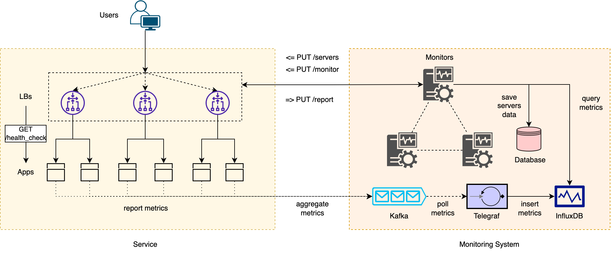

# CS230 Monitoring System for Auto-Scaling Applications

This project is a simple monitoring application built with Go, which interacts with Docker and Redis to manage container lifecycles and provide real-time status updates. We also design a simple load balancer and an application to demonstarte the auto-scaling capability of the monitoring system. 

## Introduction

In this project, we want to scale a service by building a scalable and cost-effective surrounding infrastructure. Once it can be easily replicated, the service can be anything, from a simple stateless web service like an online calculator to a state-of-the-art scam detector machine learning model.

We implemented a load balancer to distribute requests for multiple application servers and a monitor to automatically scale up and down according to current workloads. The load balancer and the monitor coordinate to update the server status in real time, ensuring accurate matching to the actual workloads.

To better understand the assumptions and the design of the system, please refer to [Fault Tolerance Model](#fault-tolerance-model) and [Consistency Model](#consistency-model).

## Features

### Load Balancer
- Load balance requests from users to application servers.
- Check alive servers every 10 seconds.
- Retry disconnected servers every 30 seconds.
- Retry a request 3 times if failed and retry 3 times to pick a different server.
- Report dead servers to the primary monitor every 10 seconds.

### Application

- Send the system data to Kafka every second. (ex:cpu usage, memory usage, throughput, health status)
- Simulate 3 types of situations. (ex: high cpu usage, low cpu usage, scale down)
- Provide a web to show the real-time updated data
- Provide a RESTful endpoint to fetch the health status of the applications.

### Monitor

- Bully leader election algorithm for master monitor election. Send the master monitor IP to the load balancer.
- Check master health status every 5 seconds from non-master monitor. If detect master dead, start new election.
- At the beginning, create one server for each zone (zone1, zone2, zone3). Send each server IP to load balancer of each zone.
- Get each servers GPU usage from Influxdb, calculate average GPU usage of each zone. If higher than maximun usage threshuld, create a new server in this zone and send new server's IP to load balancer of this zone. If lower than min usage threshuld and server number greater than 1, delete a server in this zone, and send deleted server's IP to load balancer of this zone.
- When dead server report is received from load balancer, delete this dead server.
- Use redis to store container relative information for creating, deleting and retrieving container information.


## System Architecture

The system architecture is shown below. The architecture can be divided into two parts: the service and the monitoring system.

The service part is shown on the left side. Users can send requests to the service, where the request will be distributed to an application server by the load balancers. The load balancer periodically probes the health check endpoints exposed by the application. It will retry several times until it suspects the server is totally dead. The load balancer also periodically sends the dead server list to the primary monitor to maintain the consistency of the alive servers.

The monitoring system is shown on the right side. Each application server periodically sends system metrics to Kafka in the background, and Telegraf constantly polls metrics and inserts them into InfluxDB. The primary monitor periodically queries metrics from the InfluxDB and examines whether some servers need to be allocated or deallocated. If some actions need to be performed, the updated server information is sent to the load balancer endpoint. 



To better understand the assumptions and the design of the system, please refer to [Fault Tolerance Model](#fault-tolerance-model) and [Consistency Model](#consistency-model).

## Prerequisites

Before you begin, ensure you have met the following requirements:

- Docker is installed and running.
- Redis server is accessible.
- You have a basic understanding of Docker and containerization.


## Installation

To install CS230 Go Monitor, follow these steps:

Linux and macOS:

```bash
git clone git@github.com:pingchenchan/cs230-winter24-project.git
cd cs230-winter24-project
```

## Usage
To use CS230 Go Monitor, start the services using docker-compose:

```bash
docker-compose up --build
```

This command will start the Go application along with Redis and any other defined services in the `docker-compose.yml` file.

## Consistency Model

To maintain the consistency of each application server's status, we divided servers into several regions called zones. Each zone has an associated load balancer to distribute requests among the servers in the zone. Zones are currently a logical concept with no physical meaning (see [Future Works](#future-works) for more details.) Each server will only be allocated to a single zone, and the status will be checked by the load balancer in the zone.

The reason why we choose to divide servers into several zones completely is to prevent the consistency of adding and deleting servers. For example, assume the monitor sends the new server addresses to all of the load balancers. It will be fine initially. However, if there is a network partition, different load balancers can make different decisions on whether the server is alive or not. According to our protocol, the dead servers are reported to the monitor. The question is, what to do with some load balancers that consider the server alive when a load balancer reports the server as dead? Should the monitor send a delete request to those balancers? Another problem is whether the server is really dead. Should we always clean up the reported servers or wait until we have a consensus from a quorum of servers?

As the example shows, letting all load balancers own the same server set is not a good idea, as it leads to multiple consistency issues. Although it works if the monitor regularly synchronizes servers, it is ugly and causes unnecessary complexity. We address this issue by partitioning servers into several zones. Since each server is checked by only one load balancer, the status consistency is guaranteed in this setting. Please refer to [Fault Tolerance Model](#fault-tolerance-model) for fault tolerance issues.

## Fault Tolerance Model

In our system, we assume every component can fail. For databases such as Kafka, InfluxDB, and Redis, as they all have persistence features, we can simply reboot them. Telegraf polls Kafka metrics and puts them to InfluxDB to safely reboot if it fails. The application server is the primary source of failures, but as it is stateless, we can replace it with a new instance with no side effects.

Next, we discuss the case of load balancers. In our design, the server data of each load balancer is just a delegate to the monitor data. The ground-truth server information is controlled by the monitor and saved in the Redis. Load balancers are monitor workers who maintain the servers' status. If a load balancer fails, the monitor can spin up another instance and populate the new one with the server set in the original zone. Although the old one may already detect some dead servers but cannot report to the monitor before it crashes, the new load balancer can detect them again. It will not cause inconsistency issues, only with a minor performance impact.

Finally, we talk about the monitor. We assume the monitor will not have high loads, so we only adopt the primary-backup setting for fault tolerance. If the primary monitor crashes, a new leader will be elected from the backup servers. After a new leader is elected, a new monitor address will be sent to all load balancers. If all monitors are dead, we have to reboot the cluster manually. Fortunately, the server's data is safely stored in Redis, and the safety of another component will not be violated.

## Implementation

In this section, we briefly discuss the implementation of each component.

### Load Balancer

Internally, servers are divided into three pools: alive, disconnected, and dead. Only alive servers are used to serve user requests.

In the beginning, the servers will be put into the alive pool. The alive pool is periodically checked by a background goroutine every 10 seconds. If the health check of a server fails, it would be moved into the disconnected pool.

Another goroutine periodically checks the disconnected pool every 30 seconds. If a server is reconnected again, it is put back into the alive pool. Otherwise, it stays. If we retry three times, the server is put into the dead pool and never checked again.

The dead pool is reported every 60 seconds by yet another goroutine. If the report to the monitor is successful, the dead servers are completely deleted.

**Note**: The load balancer is referenced from [Let's Create a Simple Load Balancer With Go](https://kasvith.me/posts/lets-create-a-simple-lb-go/) but with many structural and functional improvements, and testing.

**Note**: In the current implementation, we only model a completely crashed server. If a server can return 500, it is not determined dead because it could be a temporary error. To ensure this level of fault tolerance, the client library should do its own retry until it picks a health server.

**Note**: We internally use channels to synchronize the core data structure so that multiple front-end and back-end goroutines can get consistent results. The load balancer is designed to serve 10000 concurrent users. For the whole system consistency issues, please refer to [Consistency Model](#consistency-model). 


### Application

There would be 3 servers running. In the begining, we need to open the browser and enter the IP address of each servers. We would see 3 buttons wich are 'High CPU Usage', 'Low CPU Usage', 'Scale Down'. 

In 'High CPU Usage', the cpu usage would sart from 20 and become higher gradually. Once it exceed 70, it would remian between 70 to 75. It simulates high cpu usage. 

In 'Low CPU Usage', the cpu usage would sart from 20 and become higher gradually. Once it exceed 20, it would remian between 20 to 30. It  would not be more than 30. It simulates low cpu usage. 

In 'Scale down', the cpu usage would sart from 50 and become lower gradually. Once it less than 10, it would remian between 1 to 10. 

All the system data would be sent to Kafka. Kafke would store the data according to different kafka_topic. Telegraf would consume the data and write them into Influxdb.


### Monitor

The monitoring system using a bully leadership election algorithm to ensure Fault Tolerance.The master monitor watches over the health of the servers and integrates with the load balancer in real-time to ensure that the servers can be scaled up and down in a timely manner to achieve flexible resource utilization and performance.

For reliability, the non-master monitor checks the health of the mastermonitor every five seconds. If the primary monitor fails, start a Bully leader election algorithm to select a new leader. Among the remaining monitors, the one with the highest ID will be elected as the primary monitor.

The monitoring system collects GPU utilization data from each server through InfluxDB. An average GPU utilization is calculated for each zone. When this average exceeds a predefined maximum threshold, the system spawns a new server in the corresponding zone and updates the load balancer to accommodate the increase. Conversely, if the utilization drops below the minimum threshold for redundancy in the number of servers, the server is deactivated to save resources and the load balancer is notified in a timely manner.

The monitoring system uses Redis as a database, which can be used to store and query the IP of containers when they are created or deleted.


## API Reference

### Load Balancer
- `GET /health_check`: Return ok if the load balancer is alive.
- `GET /servers`: Return alive servers' address.
- `PUT /servers`: Add new servers and/or delete old servers.
- `PUT /monitor`: Update primary monitor address.

### Application
- `GET /health_check`: Return ok if the application is alive.

### Monitor
- `GET /containers`: Returns a JSON list of all running container IDs.
- `PUT /report`: Update dead servers reported from a load balancer.

## Future Works

Although our infrastructure is really scalable, it still has a few shortcomings.

First, the users have to choose among a set of load balancers before sending a request, breaking the transparency of the system. Second, we currently only support naive stateless applications and have a lot of room to improve. Third, messaging systems (Kafka, Telegraf, and InfluxDB) may not scale well to extremely large server numbers.

The third one is easy to deal with by setting up the cluster configuration for each system. The first one is also easy by creating a load balancer for load balancers and fixing the endpoint address. 

The second one is a lot more complicated and can contradict the naive solution to the first problem. To perform geographical distribution of requests, we cannot have a single endpoint, or we have to rely on the DNS infrastructure. We can have an additional endpoint purely to get the addresses of load balancers, and the rest of the process remains the same. Another concern is implementing the session semantics by remembering the user's identity. We can perform this operation at the load balancer level and bind the user to a single application unless the server dies. In conclusion, there is no simple solution to the second problem, and it requires a client library or extra components.

## References
- https://kasvith.me/posts/lets-create-a-simple-lb-go/
